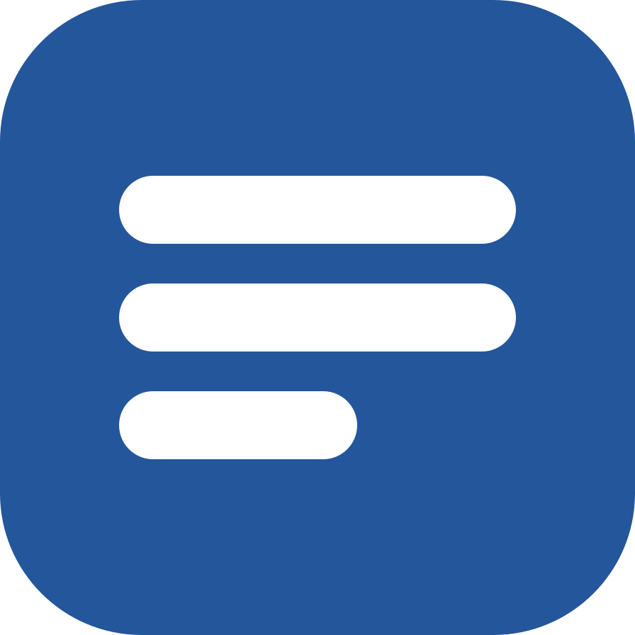

# &nbsp;Упрощённый технический русский

[](https://skills.sh/ztemerbekov/asd-ste100-ru-skill)

**Навык для Claude Code, Codex и Cursor: переписывает ответ ИИ-агента на упрощённый технический русский (УТР) по разделу 8.2 ГОСТ Р 58049—2017. В предложении — не больше 20 слов, все факты и оговорки исходного текста на месте. Русский аналог ASD-STE100.**

Агент ответил так, что непонятно, что он сделал и что делать вам? Наберите `/asd-ste100-ru` — навык перепишет последний ответ.

Примеры

| Было | Стало |
|---|---|
| В репозитории ничего не закоммичено. | Я не делал коммит в репозиторий. |

*Назван исполнитель, вместо жаргона — обычные слова.*

| Было | Стало |
|---|---|
| Мои 10 примеров ушли, примеры ГОСТа теперь лежат в файле стандарта. | Я удалил свои 10 примеров. Примеры ГОСТа теперь находятся в файле ГОСТа. |

*Вместо образов «ушли» и «лежат» — прямые слова, одно название вместо «ГОСТ» и «стандарт».*

| Было | Стало |
|---|---|
| Навык запускается только вашей командой, сам я вызвать его не могу. | Только вы вызываете навык командой. Я не могу вызвать навык сам. |

*Назван исполнитель, один глагол вместо «запускать» и «вызывать».*

- Смысл на месте: каждый факт, число, условие и оговорка остаются, новых не появляется.
- Навык работает только по команде и правит только русский текст. Код, команды и пути не трогает.

[Установить](#быстрый-старт) · [Подробнее](#подробнее-о-навыке)

## Быстрый старт

1. Откройте терминал и установите навык:

   ```bash
   npx skills@latest add ztemerbekov/asd-ste100-ru-skill -g
   ```

   Чтобы обновить навык, запустите `npx skills update`.

2. Выберите AI-агентов, в которые нужно установить навык.

3. Откройте новую сессию. Когда ответ агента будет трудно понять, наберите `/asd-ste100-ru` — навык перепишет этот ответ. Другой текст вставьте после команды.

## Подробнее о навыке

Навык переписывает последний ответ агента, ваш текст или файл. Предложение — не больше 20 слов, исполнитель назван, одно понятие — один термин. До правки агент выписывает каждый факт, условие, число и оговорку. Новый текст содержит каждый пункт и не добавляет новых.

**Что на выходе:** только переписанный текст, без вступления и пояснений. По вашей просьбе агент выдаёт таблицу правок. Каждая правка ссылается на пункт раздела 8.2. Навык включается только командой и правит только русский текст.

> **Попробуйте:**
>
> `/asd-ste100-ru`
>
> `[вставьте текст]`

[Подробнее о навыке](./docs/skills/asd-ste100-ru.md)

## Установка через маркетплейсы

Выберите AI-приложение, в котором хотите использовать навык.

Если способ установки не важен, используйте [быстрый старт](#быстрый-старт) — там достаточно одной команды.

<details open>
<summary><strong>Codex — установить через Marketplace</strong></summary>

<br>

1. Добавьте маркетплейс и установите навык:

   ```bash
   codex plugin marketplace add ztemerbekov/asd-ste100-ru-skill
   codex plugin add asd-ste100-ru-skill@asd-ste100-ru-skill
   ```

2. Откройте новую задачу Codex, чтобы загрузился установленный навык.

</details>

<details>
<summary><strong>Cursor — установить через Marketplace</strong></summary>

<br>

1. Добавьте маркетплейс:

   ```bash
   cursor-agent plugin marketplace add https://github.com/ztemerbekov/asd-ste100-ru-skill
   ```

2. Запустите Cursor Agent, откройте `/plugin` и выберите маркетплейс `asd-ste100-ru-skill`.

3. Установите плагин **Упрощённый технический русский** для пользователя или проекта.

</details>

<details>
<summary><strong>Claude Code — установить через Marketplace</strong></summary>

<br>

1. Добавьте маркетплейс и установите навык:

   ```text
   /plugin marketplace add ztemerbekov/asd-ste100-ru-skill
   /plugin install asd-ste100-ru-skill@asd-ste100-ru-skill
   ```

2. Загрузите установленный навык:

   ```text
   /reload-plugins
   ```

</details>

## Источник и лицензия

ГОСТ Р 58049—2017 «Перевод эксплуатационной документации на изделия авиационной техники с/на иностранные языки. Общие положения». Стандарт утверждён и введён в действие приказом Росстандарта от 29 декабря 2017 г. № 2129-ст.

Авторы стандарта:

- разработчики — ФГБУ «Национальный исследовательский центр "Институт имени Н.Е. Жуковского"» и ООО «Компания ЭГО Транслейтинг»;
- внёс — Технический комитет по стандартизации ТК 323 «Авиационная техника».

Раздел 8.2 «Общие требования к упрощенному техническому русскому языку» приведён в файле [`gost-r-58049-8.2.md`](./skills/asd-ste100-ru/gost-r-58049-8.2.md) дословно. Это неофициальный текст: он не является официальным изданием стандарта. Официальный текст распространяет ФГБУ «Институт стандартизации».

Код и текст навыка распространяются по [лицензии MIT](./LICENSE). Файл `gost-r-58049-8.2.md` не входит в лицензию MIT.

Ссылки:

- [Каталог стандартов ФГБУ «Институт стандартизации»](https://www.gostinfo.ru/catalog/gostlist/) — официальный распространитель стандартов;
- [ГОСТ Р 58049—2017 на meganorm.ru](https://meganorm.ru/mega_doc/norm/gost-r_gosudarstvennyj-standart/12/gost_r_58049-2017_natsionalnyy_standart_rossiyskoy.html) — карточка и текст стандарта;
- [Упрощённый технический язык — Википедия](https://ru.wikipedia.org/wiki/Упрощённый_технический_язык);
- [Контролируемый язык — Википедия](https://ru.wikipedia.org/wiki/Контролируемый_язык).

## Помощь и обратная связь

Нашли ошибку в навыке или в скрипте? Опишите её в [задачах репозитория на GitHub](https://github.com/ztemerbekov/asd-ste100-ru-skill/issues).
